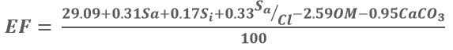

***********************************************************
Modelling Erodible Fraction Factor (EF) in LaSWE 
***********************************************************
Erodible Fraction Factor is the ability of soil to resist wind erosion based on 
chemical and physical characteristics of soil (Fryrear et al., 1998) as expressed in equation below.

Where:

Sa – sand content.
Si – silt content.
Cl – clay content.
OM – organic matter content.
CaCO3 – calcium carbonate content. 

      
The above parameters are expressed as a percentage.
Fryrear et al. (1998) developed 
and prescribed the threshold values for each soil parameter.
On physical properties i.e. soil texture, sand and silt content are light in 
terms of weight due to their high porosity nature. Clay, on the other hand, 
has low porosity, however, if the soil losses the water content, the particles 
become smaller and easily erodible. This correlation shows the relationship between water 
content in the soil and the erodible fraction.
The chemical composition i.e. Calcium carbonate alters the chemical structure of 
soil and potential hydrogen (pH), in turn leading to formation of effervesces 
in soil particles. Such soil particles are not easily erodible (Tian et al., 2018). 

Just as CE, EF applies four major steps in modelling its parameters, these steps include the following:

        * Acquire the datasets
        * Compute the factors in RWEQ QGIS plugin
        * Fuzzify the output between 0 - 1, which is sensitivity map.
        * Combine it with other factors to compute the Index of Land Susceptibility to Wind Erosion (ILSWE).

EF Data acqusition and fuzzsification
***********************************************************
To acquire data for modelling of climate erosivity, a user is expected to use the data sources as highlighted in the data source section.
The project also implemented a user manual that aids the user in preparing the datasets in a customed QGIS plugin, which is provided as a zipped 
folder for the user to download and use.
However, the use of google earth engine is also encouraged especially in acquiring and computing the factors. 
A simple code in google earth engine of acquiring and computing EF datasets and factor is as shown in the code block below.

.. code-block:: bash

                  /////////////////////////////////////////////////////////////////////////////////
                  /////////////////////SOIL DATASETS (SC, EF)

                  var clay = ee.Image("OpenLandMap/SOL/SOL_CLAY-WFRACTION_USDA-3A1A1A_M/v02")
                            .select('b30')
                            .clip(table);

                  // Map.addLayer(clay,{},'clay content');

                  var sand = ee.Image("OpenLandMap/SOL/SOL_SAND-WFRACTION_USDA-3A1A1A_M/v02")
                            .select('b30')
                            .clip(table);

                  // Map.addLayer(sand,{},'sand content');

                  var org = ee.Image("OpenLandMap/SOL/SOL_ORGANIC-CARBON_USDA-6A1C_M/v02")
                            .select('b30')
                            .clip(table);

                  // Map.addLayer(org,{},'Organic Content');

                  var silt = ee.Image("OpenLandMap/SOL/SOL_TEXTURE-CLASS_USDA-TT_M/v02")
                            .select('b30')
                            .clip(table);

                  // Map.addLayer(silt,{},'Organic Content');

                  var soil_bands = sand.addBands(clay).addBands(org).addBands(silt);

                  print (soil_bands);

                  // Map.addLayer(soil_bands.rename(['sand','clay','org','silt']),{},'Soilbands');

                  var bands_named = soil_bands.rename(['sand','clay','org','silt']);

                  // Map.addLayer(bands_named.select('silt'),{},'silt_add');

                  ////////////////////////Multiplying the SOIL PARAMETER

                  Export.image.toDrive({image:SC, scale: 300, description: {}, fileNamePrefix: 'SC',
                      region: table, maxPixels: 1e13});

                  var EF = bands_named.expression('(29.09 + (0.31 * SA) + (0.17 * SI) + (0.33 * (SA/CL)) - (2.59 * OM) - (0.95 * CACO3)) * 0.01', {
                              'OM':bands_named.select('org'),
                              'CL':bands_named.select('clay'),
                              'SA':bands_named.select('sand'),
                              'SI':bands_named.select('silt'),
                              'CACO3':bands_named.select('org'),
                              }).rename ('Erodibility Factor');

                  Map.addLayer(EF,{},'Erodible Fraction'); 
                  Export.image.toDrive({image:EF, scale: 300, description: {}, fileNamePrefix: 'EF',
                      region: table, maxPixels: 1e13});

Users who are not familiar with google earth engine, can use  `This Wind Erosion manual <https://drive.google.com/file/d/1Tg0KzqnJa-icTO-rnyAVsz9V83nuL-Ef/view?usp=sharing/>`_ to compute the factors in the  `QGIS Plugin <https://drive.google.com/file/d/1KXtpa4e7bCYwJfKXXkjcBCpx0Yqf7Gcn/view?usp=sharing/>`_. 

The user can download the plugin, install as illustrated in the manual, and follow the manual to compute all the factors.

.. figure:: ../_static/Images/wind.PNG

.. toctree::
   :maxdepth: 3
