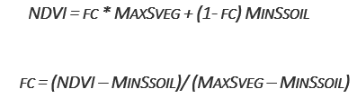

***************************************************
Modelling Fractional Vegetation Cover Factor (FC)
***************************************************
To dissipate wind soil particle movement, vegetation is identified as a key 
obstacle to preventing particle movement, with research agreeing that a 60% cover of vegetation on 
the surface, provides a barrier against wind erosion by 100%.
As a rediucing factor to wing erosion, the areas with very high vegetation are considered less susceptible to wind erosion
, and are accorded a low susceptibility value when modelling.

This is witnessed by the computation of fractional cover factor, and later fuzzification using the small membership (Inverse fuzzification).
The inverse fuzzification accords high values to areas wityh no vegetation. These areas are therefore considered highly siusceptible to soil abrasion.

The fc is generated from the Normalized Difference Vegetation

Index (NDVI) Swanker et al. (2018).
Normalized Difference Vegetation Index 
(NDVI) is a measure of vegetation health and can be computed using the equation below

.. math::
 NDVI = (NIR - Red)/(NIR + Red) 
 :label: Normalised Difference Vegetation Index

To compute the fractional vegetation cover factor(fc-factor) as expressed in the 
equation below (Swanker et al., 2018), the mean NDVI data is obtained 
as an aggregate of time series observations for the entire modelling period 2019.

Modelling the fractional cover, a user is expected to follow the following steps as is in the previous factors

  * Acquire NDVI, FC dataset
  * Compute the factors in RWEQ QGIS plugin
  * Fuzzify the output between 0 - 1, which is sensitivity map.
  * Combine it with other factors to compute the Index of Land Susceptibility to Wind Erosion (ILSWE).

Acquiring and Processing CE datasets
***************************************************
To acquire data for modelling of fractional cover, a user is expected to use the data sources as highlighted in the data source section.
The project also implemented a user manual that aids the user in preparing the datasets in a customed QGIS plugin, which is provided as a zipped 
folder for the user's download and use.
However, the use of google earth engine can also be applied especially in acquiring and computing the factors. 
A simple code in google earth engine of acquiring and computing FC datasets and factor is as shown in the code block below.

.. code-block:: bash

      var dataset = ee.ImageCollection('MODIS/006/MOD13Q1')
                        .filter(ee.Filter.date('2020-01-01', '2020-12-30'));
      var ndvi = dataset.select('NDVI').mean().clip(table);
      var ndviVis = {
        min: 0.0,
        max: 8000.0,
        palette: [
          'FFFFFF', 'CE7E45', 'DF923D', 'F1B555', 'FCD163', '99B718', '74A901',
          '66A000', '529400', '3E8601', '207401', '056201', '004C00', '023B01',
          '012E01', '011D01', '011301'
        ],
      };
      Map.setCenter(6.746, 46.529, 2);
      Map.addLayer(ndvi, ndviVis, 'NDVI_modis');

      print(ndvi);
      Export.image.toDrive({image:ndvi, scale: 500, description: 'ndvi', fileNamePrefix: 'modisndvi',
          region: table, maxPixels: 1e13}); 

    
    
      
Users who are not familiar with google earth engine, can use  `This Wind Erosion manual <https://drive.google.com/file/d/1Tg0KzqnJa-icTO-rnyAVsz9V83nuL-Ef/view?usp=sharing/>`_ to compute the factors in the  `QGIS Plugin <https://drive.google.com/file/d/1KXtpa4e7bCYwJfKXXkjcBCpx0Yqf7Gcn/view?usp=sharing/>`_. 

The user can download the plugin, install as illustrated in the manual, and follow the manual to compute all the factors.

.. figure:: ../_static/Images/wind.PNG  
    
.. toctree::
   :maxdepth: 3
   
