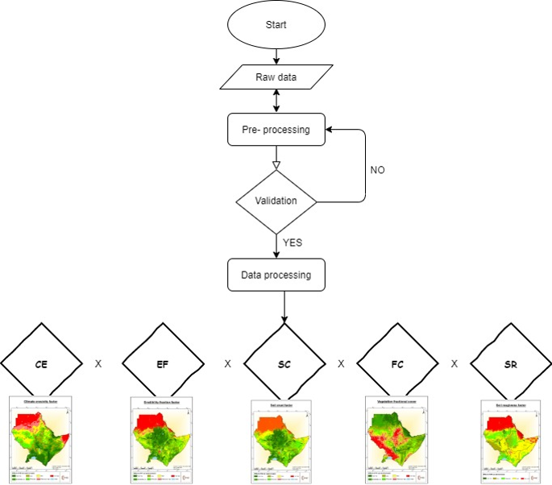
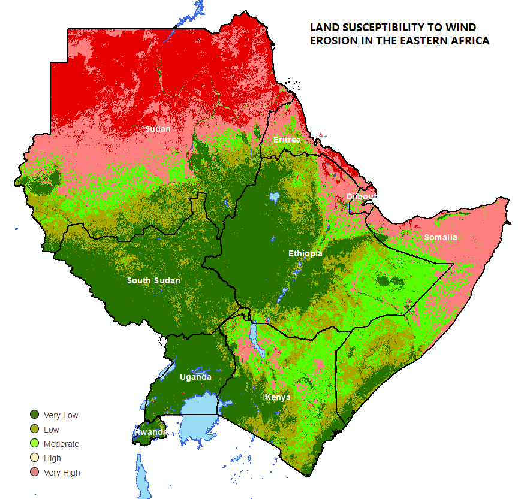

********************************************************************************
Modelling Land Susceptibility to Wind Erosion Sensitivity (LaSWE) 
********************************************************************************

Fenta et al. (2020) modified RWEQ to compute the Index of 
Land Susceptibility to Wind Erosion (ILSWE) at a regional scale. The fuzzified factors namely 
Climate Erosivity, Erodible Fraction, Soil Crust, Vegetation Sensitivity and Surface Roughness are intergrated 
in a multiplication logic as shown in the equation below.

.. math::
  ILSWE = CE * EF * SC * VC * K 
 :label: Index of land susceptibility to wind erosion

Where
* CE	Climatic Erosivity Factor
* EF	Erodibility Factor Factor
* SC	Soil Crust Factor 
* VC	Fractional Vegetation Cover Factor
* K	Soil Roughness Factor

The flow chart that summarises the methodology is as illustrated below.

Users can follow a manual to compute the final index (LaSWE) using QGIS plugin  `This is the Wind Erosion manual <https://drive.google.com/file/d/1Tg0KzqnJa-icTO-rnyAVsz9V83nuL-Ef/view?usp=sharing/>`_ and   `QGIS Plugin is here <https://drive.google.com/file/d/1KXtpa4e7bCYwJfKXXkjcBCpx0Yqf7Gcn/view?usp=sharing/>`_. 

The user can download the plugin, install as illustrated in the manual, and follow the manual to compute all the factors.

.. figure:: ../_static/Images/wind.PNG 
    
.. toctree::
   :maxdepth: 3
   
