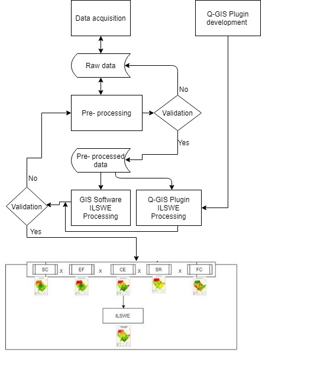

.. figure:: ../_static/Images/wind.png

*****************************************************************
Index of Land Susceptibility to Wind Erosion (ILSWE) 
*****************************************************************

Fenta et al. (2020) modified the RWEQ to compute the Index of 
Land Susceptibility to Wind Erosion (ILSWE) at a regional scale (see the equation below).

.. math::
  ILSWE = CE * EF * SC * VC * K 
 :label: Index of land susceptibility to wind erosion

Where
CE	Climatic Erosivity Factor
EF	Erodibility Factor Factor
SC	Soil Crust Factor 
VC	Fractional Vegetation Cover Factor
K	Soil Roughness Factor

The flow chart that summarises the methodology is as illustrated below.

.. figure:: ../_static/Images/wind.png  
    
.. toctree::
   :maxdepth: 3
   
