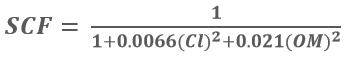

==========================================================
Modelling Soil Crust Factor - (SC) in LaSWE
==========================================================
Soil surfaces with high soil crust factor tend to form a resistive layer to wind 
erosion as a protective mechanism (Fenta et al., 2020). 
This happens in places that are highly susceptible to wind erosion. 
Areas susceptible to wind erosion may try to shield themselves 
from destructive forces such as wind erosion, thus the formation of the crusting layer.
The equation below is applied in the modelling of SCF.

Where:

Cl	Sand to clay ratio 
OM	organic matter content 

The equation shows an inverse proportionality, whereby the areas 
susceptible to wind erosion with respect to soil crust factor have 
either little or no clay and organic content. 

SCF is also linear in nature and the results were fuzzified to yield a 
sensitivity map showing high and low areas of soil crust.

 In modelling SC, a user is expected to follow the following steps

  * Acquire SOIL DATASETS
  * Compute the factors in RWEQ QGIS plugin
  * Fuzzify the output between 0 - 1, which is sensitivity map.
  * Combine it with other factors to compute the Index of Land Susceptibility to Wind Erosion (ILSWE).

Acquiring and Processing SC datasets
***************************************************
To acquire data for modelling of SOIL CRUST, a user is expected to use the data sources as highlighted in the data source section.
The project also implemented a user manual that aids the user in preparing the datasets in a customed QGIS plugin, which is provided as a zipped 
folder for the user download and use.
However, the use of google earth engine is also permitted especially in acquiring and computing the factors. 
A simple code in google earth engine of acquiring and computing SC datasets and factor is as shown in the code block below.

.. code-block:: bash
	
			var clay = ee.Image("OpenLandMap/SOL/SOL_CLAY-WFRACTION_USDA-3A1A1A_M/v02")
				  .select('b30')
				  .clip(table);

			// Map.addLayer(clay,{},'clay content');

			var sand = ee.Image("OpenLandMap/SOL/SOL_SAND-WFRACTION_USDA-3A1A1A_M/v02")
				  .select('b30')
				  .clip(table);

			// Map.addLayer(sand,{},'sand content');

			var org = ee.Image("OpenLandMap/SOL/SOL_ORGANIC-CARBON_USDA-6A1C_M/v02")
				  .select('b30')
				  .clip(table);

			// Map.addLayer(org,{},'Organic Content');

			var silt = ee.Image("OpenLandMap/SOL/SOL_TEXTURE-CLASS_USDA-TT_M/v02")
				  .select('b30')
				  .clip(table);

			// Map.addLayer(silt,{},'Organic Content');

			var soil_bands = sand.addBands(clay).addBands(org).addBands(silt);

			print (soil_bands);

			// Map.addLayer(soil_bands.rename(['sand','clay','org','silt']),{},'Soilbands');

			var bands_named = soil_bands.rename(['sand','clay','org','silt']);

			// Map.addLayer(bands_named.select('silt'),{},'silt_add');

			////////////////////////Multiplying the SOIL PARAMETERS

			var SC = bands_named.expression('1/1 + (0.0066 * (CL * CL)) + 0.21 * (OM * OM)', {
				    'OM':bands_named.select('org'),
				    'CL':bands_named.select('clay'),
				    }).rename ('Soil Crust');

			Map.addLayer(SC,{},'Soil Crust');

			Export.image.toDrive({image:SC, scale: 100, description: {}, fileNamePrefix: 'SC',
			    region: table, maxPixels: 1e13});
			    

Users who are not familiar with google earth engine, can use  `This Wind Erosion manual <https://drive.google.com/file/d/1Tg0KzqnJa-icTO-rnyAVsz9V83nuL-Ef/view?usp=sharing/>`_ to compute the factors in the  `QGIS Plugin <https://drive.google.com/file/d/1KXtpa4e7bCYwJfKXXkjcBCpx0Yqf7Gcn/view?usp=sharing/>`_. 

The user can download the plugin, install as illustrated in the manual, and follow the manual to compute all the factors.

.. figure:: ../_static/Images/wind.PNG 
  

