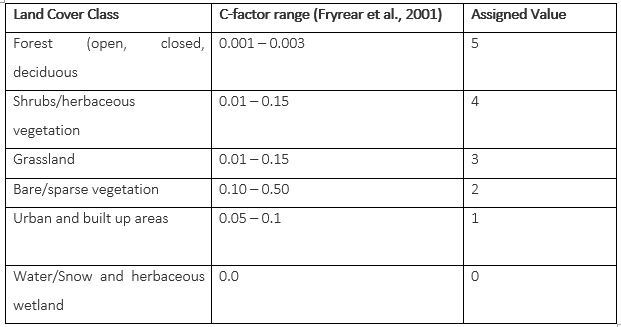

.. figure:: ../_static/Images/wind.PNG

***************************************************
Soil Roughness Factor (SR)
***************************************************
This is the availability of features on the surface that act as barriers and 
dissipates against the erosive force of wind. 

Surface roughness often shortened to roughness, is also a component of surface texture. 
It is quantified by the deviations in the direction of the normal vector of a real surface from its ideal form. 
If these deviations are large, the surface is rough; if they are small, the surface is smooth. Thus, it becomes a function of the rise and fall of land (Digital Elevation or terrain Model)

Surface roughness can also be defined by the availability of various land use classes such as vegetation 
cover that has a sheltering effect on soil particle against detachment 
and transportation by wind. For this reason, the availability of land cover data was guranteed, and was used as a proxy to surface roughness factor.
Land cover classes was reclassified into 
five major classes i.e. water, forest, perennial croplands, sparse 
vegetation and bare areas to define the surface roughness as prescribed 
by Fryrear et al. (1998) and Swanker et al. (2018). 
The reclassified land 
classes will be assigned surface roughness values as captured in table below.

The figures represent C factor values as treclassification values for soil roughness factor
derived from land use land cover.

To factor in the inverse relationship between surface roughness and wind erosion, 
the assigned values will be further fuzzified on a 0 to 1 scale using a reducing 
sigmoidal function, which assigns the highest 
sensitivity (1) to the bare areas and the lowest sensitivity (0) to the forested areas.

    
.. figure:: ../_static/Images/wind.PNG  
    
.. toctree::
   :maxdepth: 3
   
