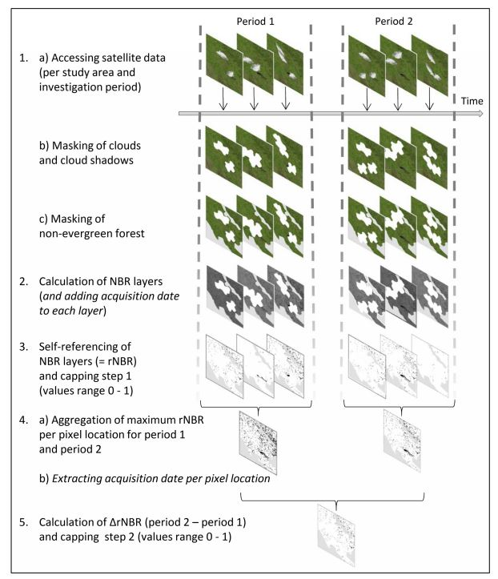

==========================================================
Forest Disturbance and Surveilance - Radar 
==========================================================
Forest Disturbance, also Degradation, which is a systematic process where the forest loses its capacity of providing the goods and services, due to continuous extraction of trees and disruption of forest ecosystem Ultimately leading to deforestation. Degradation can also can also be attributed to continuous loss of forest quality overtime.
Forest Degradation was analysed through the application of dual approach, including, the use of Optical sensor with 
	- Bivariate Radar Based Method.
 	- Optical Based Method. 
	

Forest Canopy Disturbance Using (Bivariate Method).
==========================================================
Radar images are capable of transcending the cloud cover challenge, an attribute that normally lacks with the optical sensors. The canopy disturbance monitoring using Radar images is thus considered superior due to this ability.
To compute the canopy disturbance using the Radar approach, the bivariate change method is applied, in detecting the forest canopy disturbance. 
The bivariate method captures any form of change occurring within a forest that could otherwise, have been omitted from a single look observation using either VV or VH.
Based on the difference in the backscatter values, a chi square test is performed on the difference between the images, and the significance change of 95% confidence is considered to be the areas of disturbance.
This methodology was generally anchored on simple image difference combined with statistical analysis as a mode of smoothening the model.
For a user to access this functionality, they will need to register, in order to access the possibility of having on-fly computation.
On-fly computation is based on user defined attributes such as analysis period and comparison period as will be dicussed in the service section.

The image below summarises the way features interact with radar images.

.. figure:: ../_static/Images/radar.png
    :width: 600
    :align: center
    :height: 300
    :alt: service schema
    :figclass: align-center

    Image reflectance based on Rada rmethod

Optical Based Method
=============================
The NBR, acquired through the analysis of the index of Near 
Infrared and Short Wave Infrared, was taken through the 
self-referencing steps, to allows for interoperability of 
scenes after computing the NBR using the formulae below.
	
.. math::
 NBR=  (NIR-SWIR)/(NIR+SWIR) 
 :label: eq_q
		

Afterwards, the NBR output was self-referenced with the 
image collection output acquired from equation 5 above as shown in the formulae below.
	
.. math::
 NBR=  (NIR-SWIR)/(NIR+SWIR)
 :label: eq_y
		

The resultant result is generally based on the difference between the 2 self-referenced images of the Reference period and the analysis period.
However, since the Radar approach above, is superior to the optical method, the forest surveilance was considered for method 1 above in TroFMIS system.
		

.. math::
 δNBR =rNBR_t2-rNBR_t1
 :label: eq_f
 

    Summary flow chart for canopy disturbance using Optical method.

=============================
Forest Surveilance - Radar 
=============================
Forest surveilance, which is periodical monitoring of forest canopy changes, and automatically sending the analytics to the end user, 
applied the Forest Disturbance - Radar method. However, for this specific product, a user may subscribe to recive alerts done periodically (fortnightly and monthly)
in their emails.
The alerts, once received, can be used for ground validation by the end users. 

.. figure:: ../_static/Images/trofmis3.png  
  

