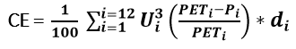

.. figure:: ../_static/Images/wind.PNG

***************************************************
Computing Climate Erosivity Factor (CE)
***************************************************
To compute CE in the LaSWE system. Please follow the steps as highlighted below.

Where: 
  - U is mean wind speed (m/s) at 2-10 m height in 
  - PETi is mean potential evapotranspiration 
  - Pi	is precipitation (mm) 
  - di	is the total number of days’ observation was made

Wind speed U and soil moisture (PET and P) 
are directly proportional to climatic erosivity while 
(PET) is inversely proportional to the climatic erosivity. 
When the PET is greater than the precipitation the moisture is 
removed from the soil, the adhesive force reduces, as a result 
the weight reduces making the particle susceptible to detachment 
and transportation by wind. 
When the Precipitation is higher than the evapotranspiration, 
the water is absorbed by soil particles, the particles 
increases in weight due to mutual adherence to surrounding particles, 
as a result the soil particles are less susceptible to detachment  and 
transportation by wind.

  Note: 

The value ranges of the above parameters should be meaningful; 
it is recommended the values are rescaled to fit in 
within the meteorological known values for each 
particular datasets; because the remotely acquired 
datasets may not necessarily come with the expected value ranges. 
However, for generating a 
sensitivity map, the final CE will be fuzzified by a linear function to yield 
values that are between 0 and 1 scale. Fuzzification saves a user 
the complexities of rescaling their values to laboratory 
tested ranges as applied by (Fryrear et al., 1998). 

    

  
.. figure:: ../_static/Images/wind.png  
  

.. toctree::
   :maxdepth: 3

