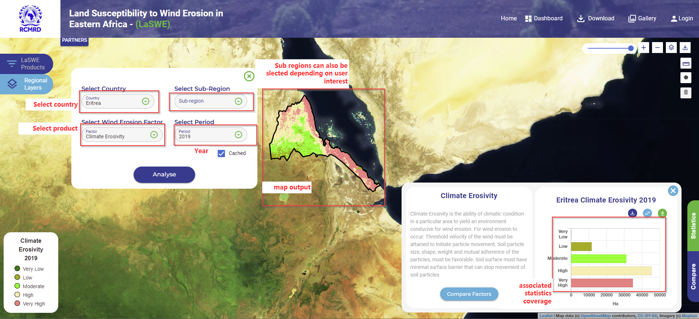
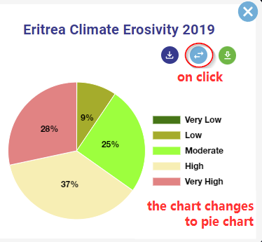
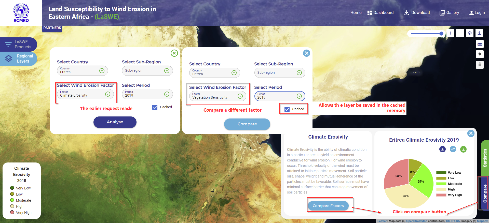
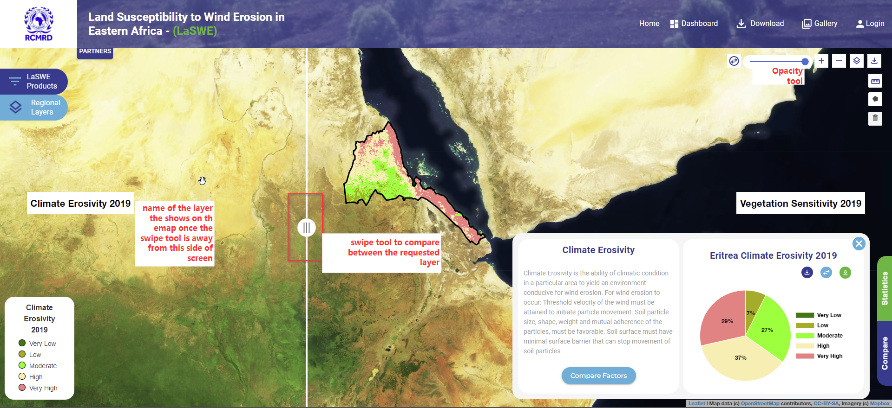

*************************************************************************
Computing Climate Erosivity Factor (CE) -  Country Scale Product
*************************************************************************
To compute the climate erosivity factor at a country scale. Please follow the following steps 
to request the layer.

1.Request for a layer and region of interest
*************************************************************************
A country of interest as well as a factor of interest, is requested as shown below.
Once the user requests the layer, the map is visualised as is shown in the map view below.

The user can also change the chart type, depending on their preferences. The chart type can be changed using the following functionility.

2.Compare Climate Erosivity layer
*************************************************************************
Once a layer has been requested, a user can compare that requsted layer within the region of interest, with any other available 
wind erosion factors including:
   * Climate Erosivity of a different year
   * Erodible fraction factor of same of a different year
   * Soil Crust factor 
   * Vegetation Sensitivity layer
   * Surface Roughness layers as shown below.
   
   

Once the user request the layer, the layers can be visualised using the swipe tool as is shown below. 

.. figure:: ../_static/Images/wind.PNG

.. toctree::
   :maxdepth: 3

