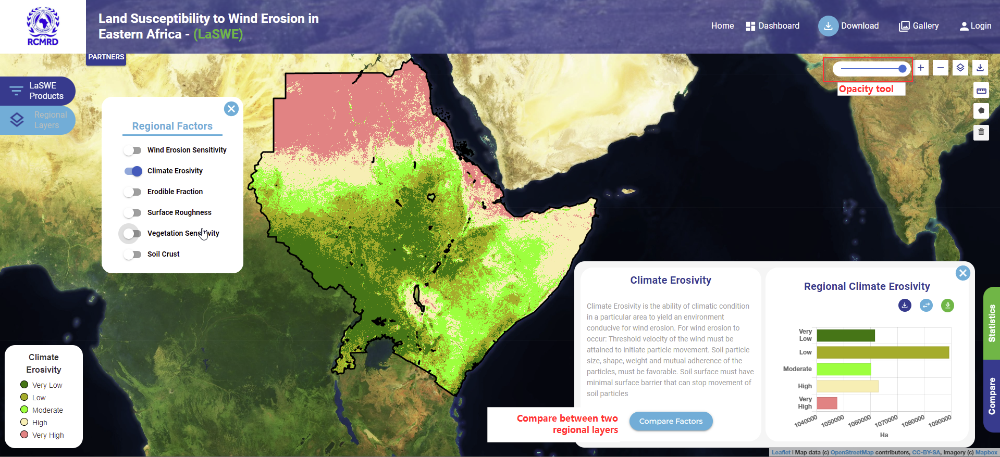

***************************************************
Computing Climate Erosivity Factor (CE)
***************************************************
System users are able to process, and querry the system, depending on their data and visualisation needs.
To ocmpute Climate Erosivity, A user will access it as is illustrated in the figure below.

The user can download the data from the system, and visualise it based on their preferences.

.. toctree::
   :maxdepth: 3

