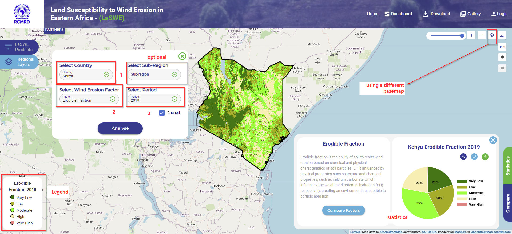
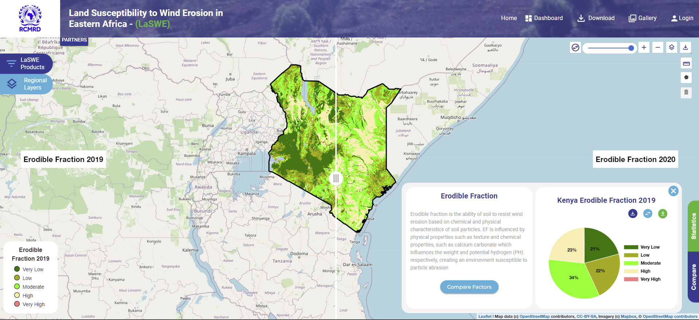

.. figure:: ../_static/Images/wind.PNG

*******************************************************************************
Computing Erodible Fraction Factor (EF) -  Country level product
*******************************************************************************
Just as climate erosivity and other products, computation of EF follows a prescribed steps and processes,
that enables th euser to define the:

         * region of interest (country), 
         * the year of interest, and 
         * factor of interest.

Requesting region of interest, year and factor of interest (EF)
*******************************************************************************
Users can navigate and select the inputs as shown in the screenshot below. The requested layer comes together with 
statistics and small description about the factor, and its contribution to promoting wind erosion in the region.

The user has liberty to juggle between basemaps and chart as shown in the above image. 
Just as climate erosivity, erodible fraction factor can be compared between any factor, depending on the interest of the user.
An image comparing EF of Kenya with EF of different year is as shown below.

.. figure:: ../_static/Images/wind.PNG

.. toctree::
   :maxdepth: 3
