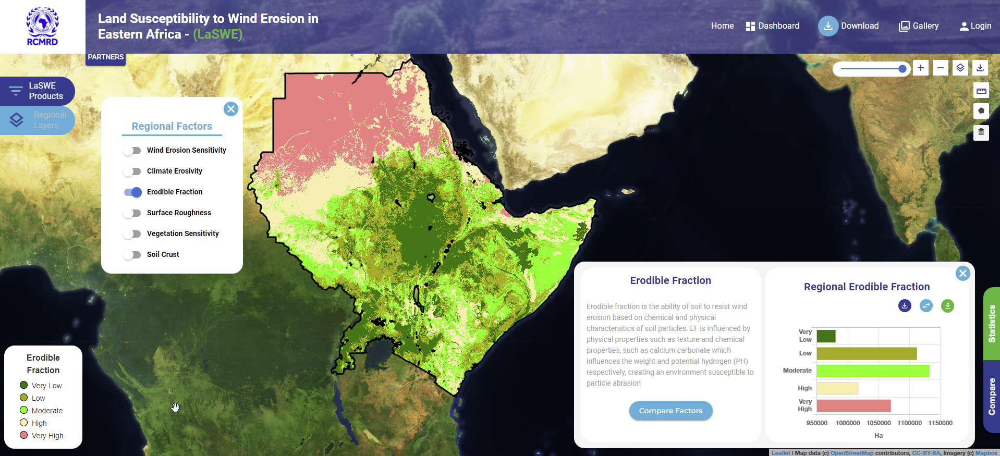

.. figure:: ../_static/Images/wind.png

***************************************************
Computing Erodible Fraction Factor (EF)
***************************************************
This is the ability of soil to resist wind erosion based on 
chemical and physical characteristics of the 
soil (Fryrear et al., 1998) as expressed in equation below.

Where:

Sa – sand content.
Si – silt content.
Cl – clay content.
OM – organic matter content.
CaCO3 – calcium carbonate content. 

      
The above parameters are expressed as percentage. Fryrear et al. (1998) developed 
and prescribed the threshold values for each soil parameter.
On physical properties i.e. soil texture, sand and silt content are light in 
terms of weight due to their high porosity nature. Clay, on the other hand, 
has low porosity, however, if the soil losses the water content, the particles 
become smaller and easily erodible. This correlation shows the relationship water 
content in the soil and the erodible fraction.
The chemical composition i.e. Calcium carbonate alters the chemical structure of 
the soil and potential hydrogen (pH), in turn leading to formation of effervesces 
in soil particles. Such soil particles are not easily erodible (Tian et al., 2018). 
EF is linear in nature and the results will be fuzzified to yield a vulnerability map 
showing high and low EF.

.. figure:: ../_static/Images/wind.png

.. toctree::
   :maxdepth: 3
