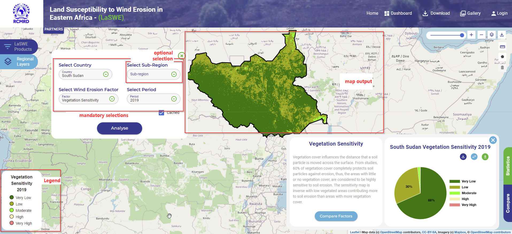

.. figure:: ../_static/Images/wind.PNG

********************************************************************
Computing Vegetation Sensitivity Factor (VC) -  Country Scale
********************************************************************
As ealier discussed, VC is generated from the Normalized Difference Vegetation 
Index (NDVI) Swanker et al. (2018). Normalized Difference Vegetation Index 
(NDVI) is a measure of vegetation health and can be computed using the equation below

.. math::
 NDVI = (NIR - Red)/(NIR + Red) 
 :label: Normalised Difference Vegetation Index

To compute the fractional vegetation cover factor(fc-factor) or vegetation sensitivity as expressed in the 
equation below (Swanker et al., 2018), the mean NDVI data is obtained 
as an aggregate of time series observations for the entire modelling period.#

Defining the country of interest, and VC factor in the selection area, visualises a map of vegetation sensitivity as shown in the map below.

To compute the Fractional Cover in the system, the illustration above is adequate to generate the FC product.

    
.. figure:: ../_static/Images/wind.PNG 
    
.. toctree::
   :maxdepth: 3
   
