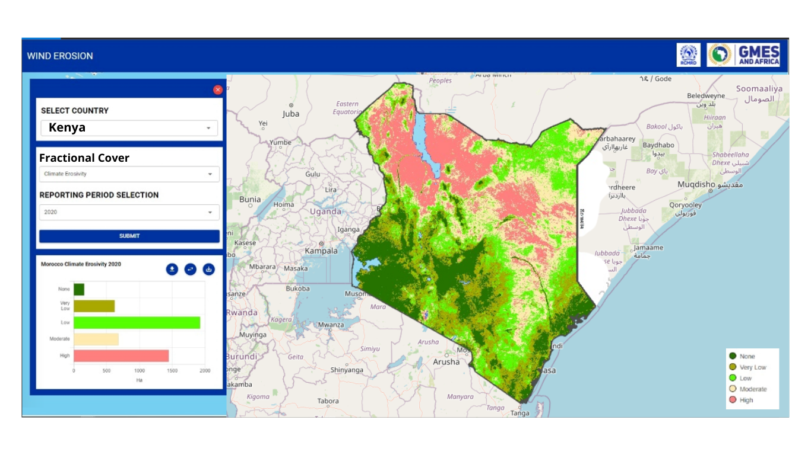

.. figure:: ../_static/Images/wind.PNG

***************************************************
Computing Fractional Vegetation Cover Factor (FC)
***************************************************
The fc value is generated from the Normalized Difference Vegetation 
Index (NDVI) Swanker et al. (2018). Normalized Difference Vegetation Index 
(NDVI) is a measure of vegetation health and can be computed using the equation below

.. math::
 NDVI = (NIR - Red)/(NIR + Red) 
 :label: Normalised Difference Vegetation Index

To compute the fractional vegetation cover factor(fc-factor) as expressed in the 
equation below (Swanker et al., 2018), the mean NDVI data was obtained 
as an aggregate of time series observations for the entire modelling period 2019.

To compute the Fractional Cover in the system, the illustration below is adequate to generate the FC product.

    
.. figure:: ../_static/Images/wind.png  
    
.. toctree::
   :maxdepth: 3
   
