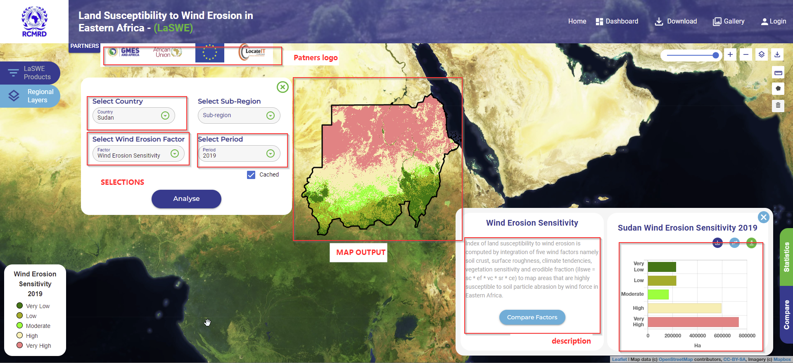

.. figure:: ../_static/Images/wind.PNG

*****************************************************************
Computing Index of Land Susceptibility to Wind Erosion (ILSWE) 
*****************************************************************
Index of Land Susceptibility to Wind Erosion is th eultimate product, generated 
when the wind factors are intergrated using a multiplication logic.
The output  maps out areas that are sensitive or susceptible to 
be affacted by soil particle movement.

Computation and request of Wind Erosion Sensitivity can be requested as shown below in LaSWE.

    
.. figure:: ../_static/Images/wind.PNG 
    
.. toctree::
   :maxdepth: 3
   
