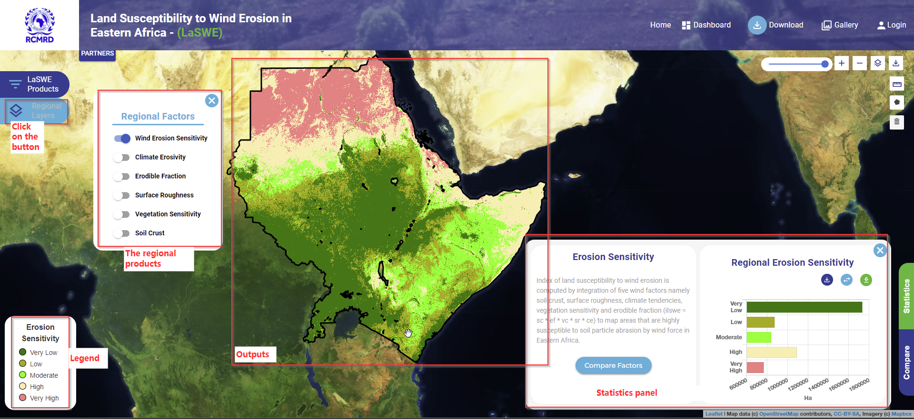

.. figure:: ../_static/Images/wind.PNG

*****************************************************************
Computing Index of Land Susceptibility to Wind Erosion (ILSWE) 
*****************************************************************
To compute index of land susceptibility to win derosion, a user can follow the following steps
as showed in the illustration below.

    
.. figure:: ../_static/Images/wind.PNG 
    
.. toctree::
   :maxdepth: 3
   
