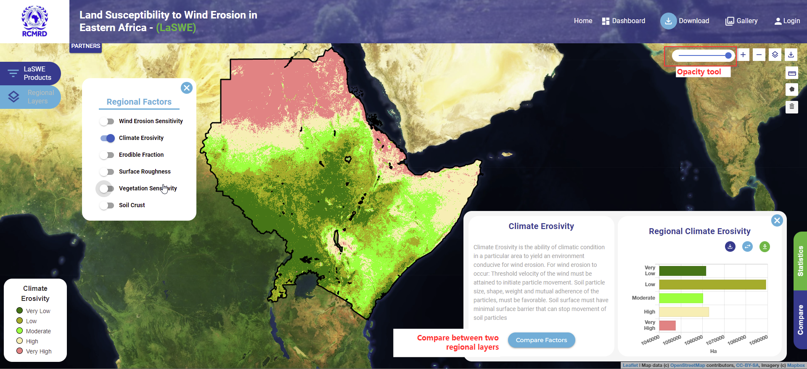
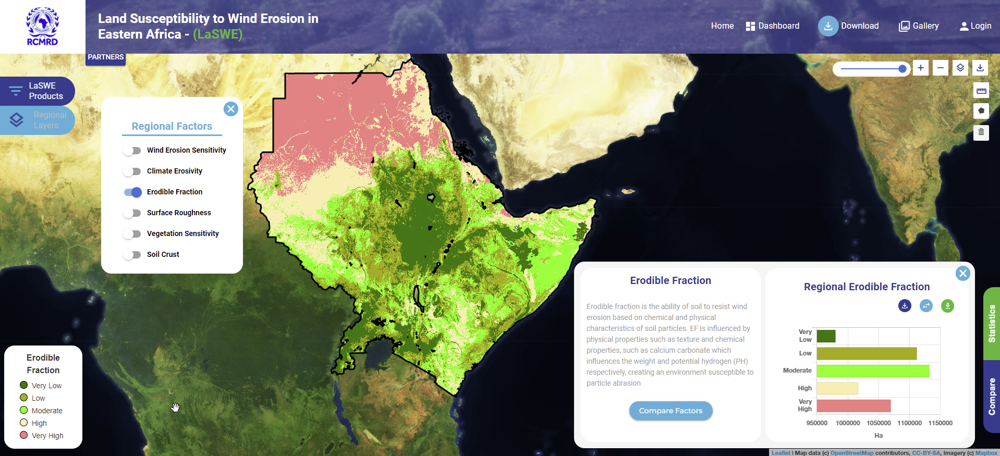
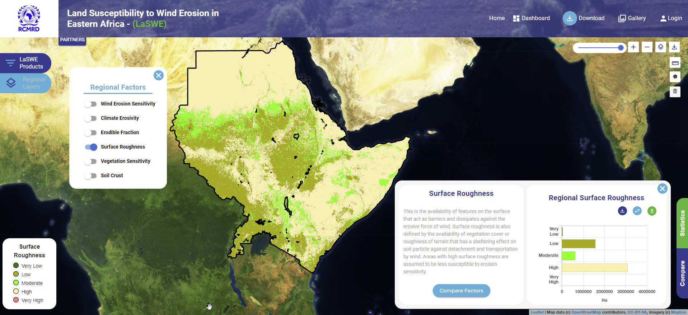
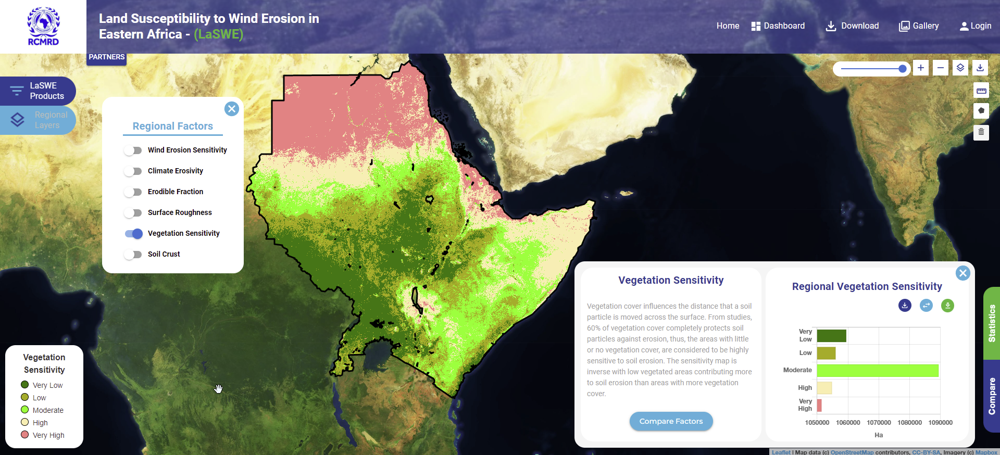
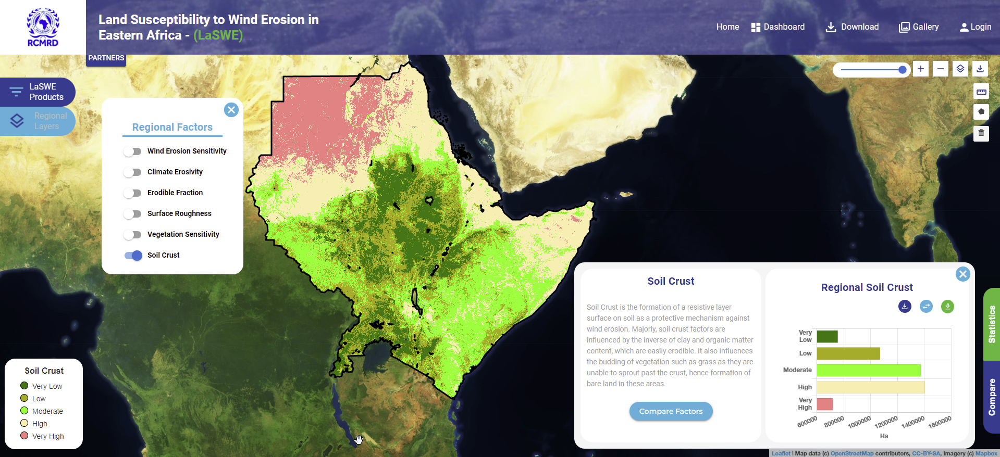

***************************************************
LaSWE Regional Products
***************************************************
LaSWE has levels of products, including regional scale products and country based products.
The country based products are designed to show sensitivity to wind erosion at a country scale.
The regional scales on the other hand shows products at a regional scale. The regional products
are computed as shown in the following sections below.

1. LaSWE - Index of Land Susceptibility to Wind Erosion 
********************************************************************
To compute the above 2019 product, LaSWE provides the layer by default, that can be requested as shown below.
Once the user checks a product in the checklist, the system visualises the output as shown below.

.. figure:: ../_static/Images/OVER.png

2. LaSWE - Climate Erosivity Product
********************************************************************
Climate Erosivity layer in 2019 for LaSWE can be requested as shown below.

3. LaSWE - Erodible Fraction Factor
********************************************************************
Erodible Fraction (EF) layer of 2019 for LaSWE can be requsted as shown below.

4. LaSWE - Surface Roughness Factor
********************************************************************
Surface Roughness (SR) layer of 2019 can be requsted as shown below.

5. LaSWE - Vegetation Sensitivity Factor
********************************************************************
Vegetation Sensitivity layer of 2019 can be requsted as shown below.

6. LaSWE - Soil Crust Factor
********************************************************************
Soil Crust factor layer of 2019 can be requsted as shown below.

