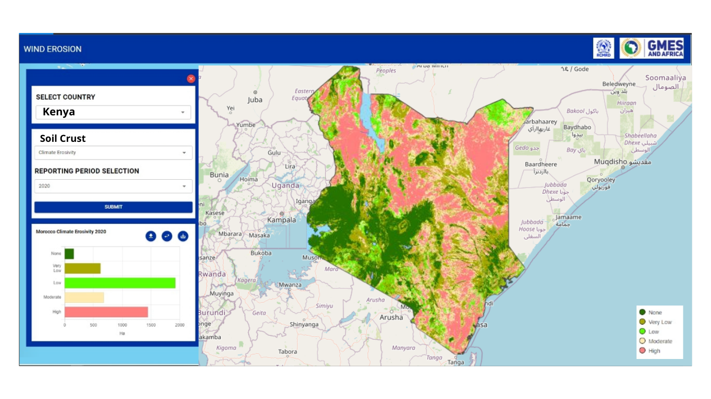

.. figure:: ../_static/Images/trofmis3.png

==========================================================
Computing Soil Crust Factor - (SC) 
==========================================================
Soil surfaces with high soil crust factor tend to form a resistive layer to wind 
erosion as a protective mechanism (Fenta et al., 2020). 
This happens in places that are highly susceptible to wind erosion. 
The behavior of soil surfaces in these specific areas proves the 
Charles Darwin hypothesis of adaptation and survival for the fittest. 
The areas susceptible to wind erosion may try to shield themselves 
from destructive forces such as wind erosion. 
The equation below is applied in the evaluation of SCF.

Where:

Cl	Sand to clay ratio 
OM	organic matter content 

The equation shows an inverse proportionality, whereby the areas 
susceptible to wind erosion with respect to soil crust factor have 
either little or no clay and organic content. 

SCF is also linear in nature and the results were fuzzified to yield a 
sensitivity map showing high and low areas of soil crust.

	

.. figure:: ../_static/Images/wind.png  
  

