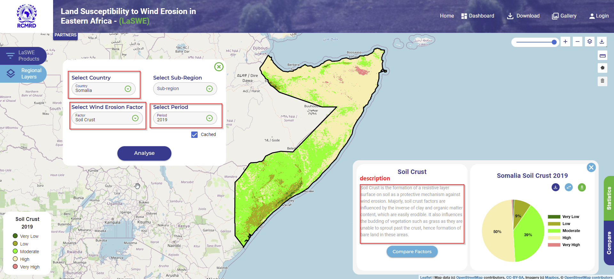

.. figure:: ../_static/Images/wind.PNG

==========================================================
Computing Soil Crust Factor - (SC) - Country Scale
==========================================================
As ealier discussed, soil crust factor is the protective layer that forms on the surface 
to prevent soil particle movement.

To compute soil crust factor in LaSWE, please follow the illustration shown below.

Where:

Cl	Sand to clay ratio 
OM	organic matter content 

Soil Crust factor can also be compared with other layers and factors as listed in the LaSWE system.

	

.. figure:: ../_static/Images/wind.PNG 
  

