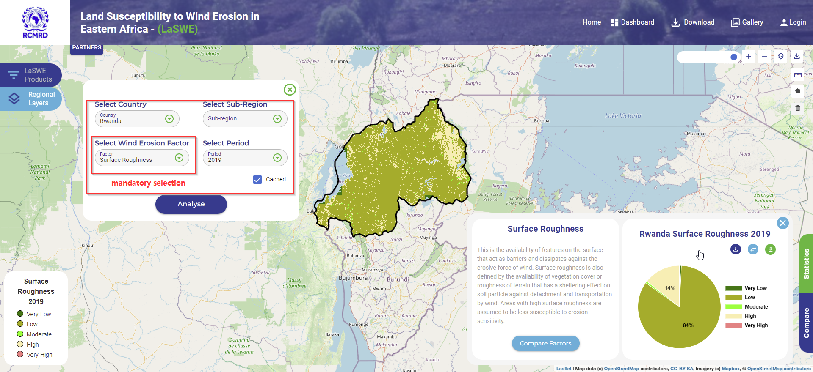

.. figure:: ../_static/Images/wind.PNG

*******************************************************************************
Computing Surface/Soil Roughness Factor (SR) -  Country Level Product
*******************************************************************************
LaSWE provides a user the ability to request SR layer, being a dynamic layer of the system, different years can also be requested.
As is with the request of other types of layers, the selection of country, factor and year of analysis is paramount and manadatory in 
receiving a map output. The process of requesting surface roughness factor is shown below.

    
.. figure:: ../_static/Images/wind.PNG 
    
.. toctree::
   :maxdepth: 3
   
