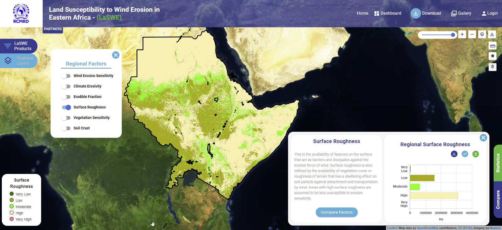

.. figure:: ../_static/Images/wind.PNG

***************************************************
Computing Soil Roughness Factor (SR)
***************************************************
This is the availability of features on the surface that act as barriers and 
dissipates against the erosive force of wind. 
Surface roughness is also defined by the availability of vegetation 
cover that has a sheltering effect on soil particle against detachment 
and transportation by wind. 
In computing Soil roughness factor in the system, the user should follow the illustration as is 
shown below.

    
.. figure:: ../_static/Images/wind.PNG 
    
.. toctree::
   :maxdepth: 3
   
