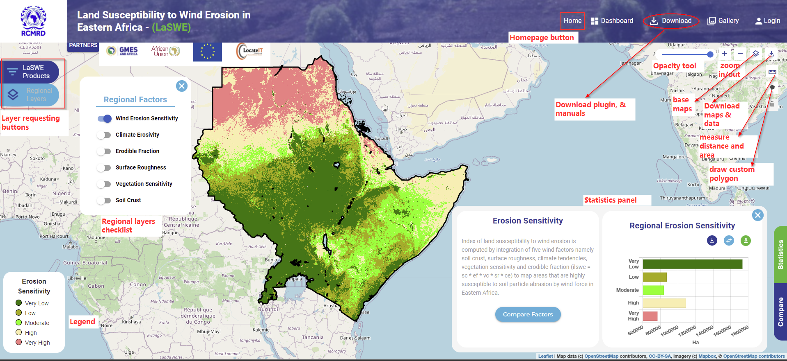
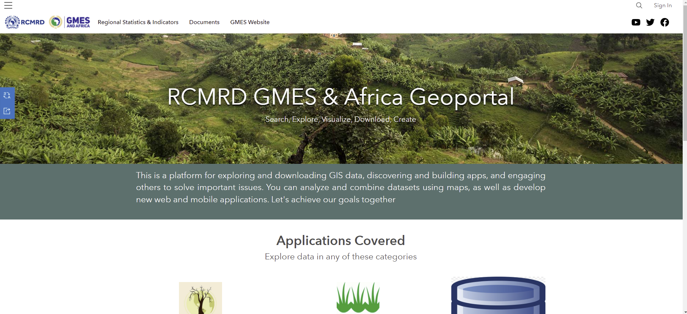

***************************************************
LaSWE System Overview
***************************************************
The developed LaSWE System, was developed as a visualisation platform to enable the users easier access to 
summarised information pertaining to their countries susceptibility to wind erosion, as well as charts and statistics.
LaSWE system provides the user with the libaty to access modelled outputs at a clicck of a button, while communicating complex scientific
information in a manner that can be understood easily, ny both users and policy makers.
LaSWE system has various components as shown in the following sections.

**1. System overview**
*************************************

The snip below shows some functionalities of the system. The user can access various features while navigating with the 
tool-buttons shown in the screenshot below.

   

The functionalities include:

**2. System Registration**
*************************************

Ability of a user to log in or create an account, using their credentials
The use will be allowed to regester, this is in preparation towards enebaling a user provide feedback in case 
of any reporting to do.
Registration also enables monitoring of the number of users in the system, and assess impact to th eend users.

A user is required to enter their details in the form shown above and register as a user. However, the system does not have restriction
of use, incase a user has not signed in.

**3. System Gallery**
*************************************
System gallery gives users a pipeline to provide feedback to the system maintenance team.
In other occasions, the gallery will be used to give ground truth information on the true picture
on the ground. The gallery contains images collected by users.

**4. Download functionality**
************************************
This functionality provides the user with access to resources including 

   * LaSWE system user manual (Docs)
   * Access a zipped plugin for installation in QGIS
   * Download Mapographic, a summarised version of outputs and reccomendations.
   
 .. figure:: ../_static/Images/download.png
   
  
  **5. Home Button**
*********************************** 
The home button leads the user to LaSWE homepage. The system homepage is linked to RCMRD website as the lead patners in implementing the 
Land Sensitivity to Wind Erosion.

.. toctree::
   :maxdepth: 3

