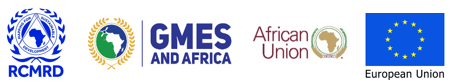

=====================
General Information
=====================

The Global Monitoring for Environment and Security (GMES) & Africa Programme is a joint 
initiative co-financed by the European Commission and the African Union Commission. 
The objective of the GMES & Africa Programme was to address the growing needs of African countries 
to access and use Earth Observation (EO) data for the implementation of sustainable development 
policies across the continent. The Program was explicitly designed to respond to African needs 
in water, natural resources, marine and coastal areas as well as address global needs to manage 
the environment, mitigate climate change and ensure civil security. It was additionally designed 
to enable the implementation of the African Space Policy and Strategy formulated to harness the 
continent's capabilities in utilizing space science and technology for economic growth and 
sustainable development.
As part of the global objectives highlighted in the mission and vision of GMES & Africa project, 
the Regional Centre for Mapping of Resource for Development (RCMRD), through its partnership with 
the private sector, implemented the assignment on Wind Erosion Modelling in the Eastern Africa region.
The assignment entailed the modelling of wind erosion susceptibility in the Eastern Africa Region, 
as part of greater assignment on environmental monitoring. Thereafter, visualized the outputs in 
a web service, a user-friendly portal that allowed the user to interactively explore wind erosion 
susceptible areas, in addition to generating insights.

Get in touch with the team
--------------------------
To get in touch with Land Susceptibility to Wind Erosion (LaSWE) team and developers, please contact the
`Regional Centre for Mapping of Resource for Development (RCMRD) <https://www.rcmrd.org/>`_, or you can reach out through 
info@locateit.com or vivianne.meta@locateit.co.ke

Authors
--------------
LaSWE system was implemented by RCMRD under the Global Monitoring for Environment and Security & Africa(GMES & Africa)
project. A project co-funded by the African Union (AU) and the European Union (EU).

Contributors to the project
included Dr. Emmanuel Nkurunziza, Mr. Sendabo Degelo , Mr. David Ongo, Mr. Ngugi, Dr. Anthony Odongo, Prof. Elias Acacuwun, Ms. Vivianne Meta, Mr. Seth Nyawacha, Mr. Derick Ongeri,, Mr. Collins Asega, Ms. Risper Mutinda, Mr. Morris Mwaura, and Mr. Simon Ndarau.

Aknowledgement
------------------
Special appreciation to `RCMRD <https://www.rcmrd.org/>`_ team in their support during validation of the LaSWE products. The developers from LocateIT team also did a tremendous job, in developing the
web application as well as modelling the model in the Eastern Africa Region.

License
--------
LaSWE system is free and open-source system. It is licensed under the GNU General Public License, version 2.0 or later.

.. note::
   This site and the products of LaSWE region are made available under the 
   terms of the Creative Commons Attribution 4.0, 
   International License (CC BY 4.0).
   The boundaries and names used, and the designations used, in LaSWE do not 
   imply official endorsement or acceptance by RCMRD, or its partnering 
   organizations.
   
   

    
    
.. toctree::
   :maxdepth: 2
