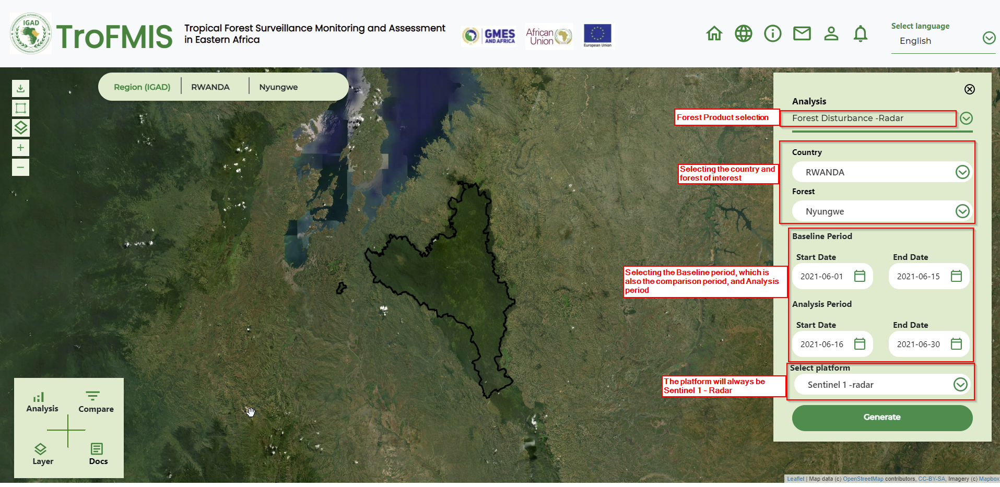
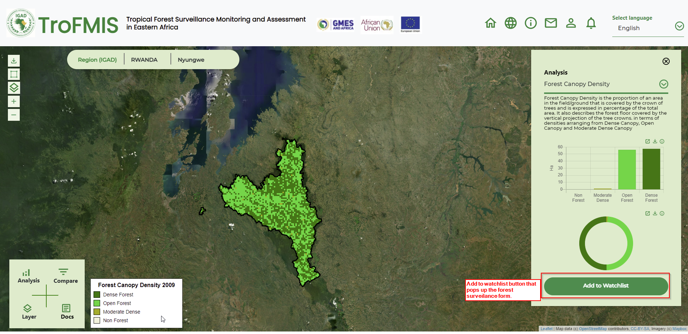

***************************************************
Compute Forest Disturbance - Radar
***************************************************
To compute forest distubance, the user is required to select the Forest Disturbance Product from the drop downlist as 
other forest products.

.. figure:: ../_static/Images/analysis_selection.png
    :width: 600
    :align: center
    :height: 300
    :alt: service schema
    :figclass: align-center

    System Product Selection

The user, after selecting the forest product, should go ahead and populate the form with attributes 
including Country, Forest of Interest, baseline period and analysis period, as well as the data platform.
The selected period should be atleast a fortnight (two weeks), this is to enable for accurate product computation.
The image below summarises the steps.

The Baseline period acquires all images within that period, they are averaged to genearate a single image.
The single image from baseline, is then comprared and differenced from the other image in the Analysis period.
The change in the two images, are used to generate the disturbance in specific areas.

***************************************************
Compute Forest Surveilance
***************************************************
To perform forest serveilance services, a user may access the service from different areas of the system.
But generally, A user can select from the drop down list as other products.

.. figure:: ../_static/Images/analysis_selection.png
    :width: 600
    :align: center
    :height: 300
    :alt: service schema
    :figclass: align-center

    Forest Surveilance Product Selection
 
A user can also access the product from clicking on the add to watch list button that exist after generation of the 
statistics of different forest products.
 
 

    Forest Surveilance Product Selection
 
 After accessing the forest surveilance product, a user is required to fill the forest surveilance form and define their 
 specified attributes.
 Forest surveilance takes in
    - Country
    - Forest of interest
    - Duration of monitoring 
    - Platform, which is Sentinel 1 Radar
    
 The figure below shows the capture of the form.
 
.. figure:: ../_static/Images/suv.png
    :width: 600
    :align: center
    :height: 300
    :alt: service schema
    :figclass: align-center

    Forest Surveilance form
 
 
.. figure:: ../_static/Images/trofmis3.png
 
 

.. toctree::
   :maxdepth: 3
