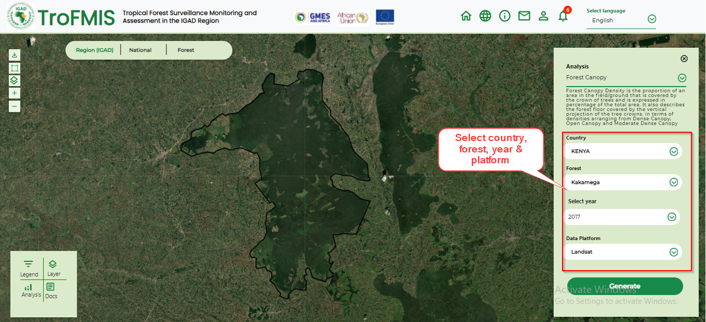

***************************************************
Computing Forest Canopy Density
***************************************************

1. To compute Forest Canopy Density, select the Forest Canopy density product from the from the drop down list.

.. figure:: ../_static/Images/analysis_selection.png
    :width: 600
    :align: center
    :height: 330
    :alt: service schema
    :figclass: align-center

    System Product Selection (FCD)

2. Select the values\attributes to fill in the selection slots as shown in the 
figure below.

    FCD Canopy Selection in TroFMIS

3. Click generate to generate the map and statistics as shown in the figure below.

.. figure:: ../_static/Images/FCD_output2.png
    :width: 700
    :align: center
    :height: 350
    :alt: service schema
    :figclass: align-center

    FCD Output map

4. The map output incoporates some features,  including

	- Legend: Used to interpret the map
	- Chart: Gives a summary statistics of class value distribution in hectares
	- The control buttons: Enable the user to generate another product, or compare between the layers.
	
Please note the automatic population of User selection in the highlighted components. This will give the user an easier way of 
reference to the forest of interest generated.

.. figure:: ../_static/Images/population.png
    :width: 700
    :align: center
    :height: 350
    :alt: service schema
    :figclass: align-center

    Area of interest pre-fillerd in the TroFMIS

.. toctree::
   :maxdepth: 3
