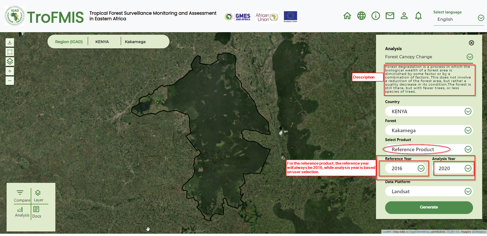

***************************************************
Computing Forest Canopy Change (FCC)
***************************************************
In order to compute Forest Canopy Change, the user needs to select the 
Forest Canopy Change product in the drop down list as was done in the previous selection on Forest Canopy Density.

.. figure:: ../_static/Images/analysis_selection.png
    :width: 700
    :align: center
    :height: 350
    :alt: service schema
    :figclass: align-center
    
    Forest Canopy Change Selection 

The user will also need to specify the following attributes before computing the final FCC product as shown in the figure below.

	- Country, 
	- Forest of interest, 
	- The year and the 
	- Platform.

.. figure:: ../_static/Images/Fchange.png
    :width: 700
    :align: center
    :height: 350
    :alt: service schema
    :figclass: align-center

    Forest Canopy Change attribute selection
    
Forest Canopy Change product is classified into 2 products, including:
	- Annual product: which is the change computed from the difference in canopy between consequent years.
	- Reference product:  the canopy change computed from the difference in canopy between the reference canopy (2016) and consequent years
	2017, 2018, 2019 and 2020.
The latter product is mainly considered for REDD+ reporting and carbon emmission monitoring, while the former is considered for forest condition monitoring.
The user is required to select either of the products for visualisation as shown below.

.. figure:: ../_static/Images/FCC.png
    :width: 700
    :align: center
    :height: 350
    :alt: service schema
    :figclass: align-center

    Forest Canopy Change product selection

The figures below highlights the product selection. The product form slightly changes depending on the type of product as above.

.. figure:: ../_static/Images/annual.png
    :width: 700
    :align: center
    :height: 350
    :alt: service schema
    :figclass: align-center

Forest Canopy Change annual product selection

For Refernce product, please note the change in the drop down list and the logic of computation as discussed in previous chapter.

Forest Canopy Change reference product selection

When the user clicks generate button, the forest change map is visualised as shown below.

.. figure:: ../_static/Images/Change_output.png
    :width: 700
    :align: center
    :height: 350
    :alt: service schema
    :figclass: align-center

    Forest Canopy Change Map Output

To undestand the FCC product, product description is highligted on the right panel, as well as the class statistics for the maps.
The maps generated are based on the type of product selected on the product drop down.

.. toctree::
   :maxdepth: 3
