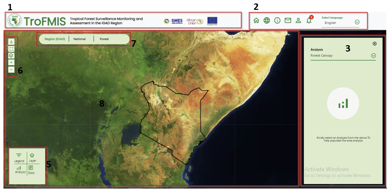
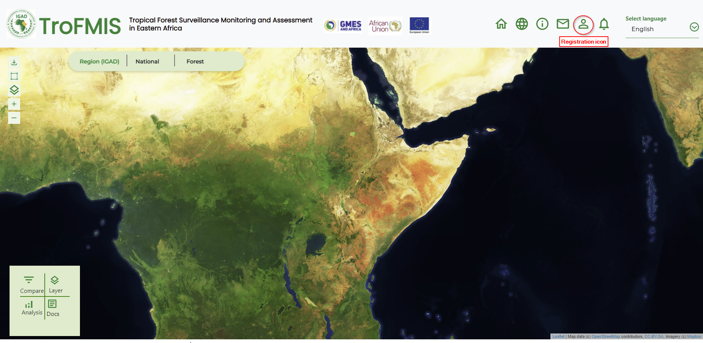

***************************************************
TroFMIS Service Guide
***************************************************
The various users are able to do their specified analysis within the TroFMIS system.
The system ergonomicscan be experienced with the tools within the system, as well as the arrangement of the 
different components that the user access.
They various tools and functionalities are as shown in the figure below and described in the next section.

    Service Tools (TroFMIS)

	- 1.
 
TroFMIS system navigation bar comprising of the title, and the 
patner logos inclusive of GMES & Africa, African Union Commission and European Union.

	- 2. 
System tools comprising of the Home button, linking to the home page of the system.
The dashboard button leading to the system dashboard where computation and layer selection can be done, system information icon i, messaging icon for message notification, the User registration button, that allows the user to register for alerts, 
Notification icon to allow the user manage their subvscribed alerts and loaded shapefiles seamlessly.

	- 3. 
Right Side panel comprising of selection panel for selecting type of analysis, which is connected to the left bottom panel.

	- 5. 
The left corner panel comprising of buttons to activate the analysis panel,
comparison tool between layers, and documentation where all the step by step use of the system is documented.

	- 6. 
System tools section, from top download data icon, for drawing customed boundaries, changing and selecting different base map icon, zoom in/out button respectively.
	
	- 7. 
The comparison tool box including opacity and swap tool from left to right. 

System Selection
====================================

The TroFMIS system contains the forest products including

	- Forest Canopy Density
	- Forest Canopy Change
	- Carbon Flux/Emmission
	- Forest Disturbance - Radar
	- Forest Surveilance - Radar

In order to compute these products, the user needs to select the products from the drop down list
bar as shown in the figure below.

.. figure:: ../_static/Images/analysis_selection.png
    :width: 600
    :align: center
    :height: 330
    :alt: service schema
    :figclass: align-center

    System Product Selection (TroFMIS)

The selection of the forest products will allow the user to select
the Country, Forest of Interest, The analysis year and the Platform from which to base their analysis. 
The platform is either

	- Landsat
	- Sentinel
While the area of interest could be any forest that the user is interested in monitoring.
After selection, the user can generate the products using the generate button.The process of generating product
is discussed under specific system product generation in the next section.

User Registration
====================================
In order to access some specific system functionalities, such as computing the Forest Surveilance using Radar,
A will be required to register and log in wih their credentials, specifying their user name and email addresses.
Top register please click the icon as illustrated in the figure below.

    Registration icon.

After accessing the registration form, a user will insert their preffered credentials and a working email in order to recieve the specified 
output after computation. The registration form is as shown in the figfure below.

.. figure:: ../_static/Images/register.png
    :width: 600
    :align: center
    :height: 330
    :alt: service schema
    :figclass: align-center

    Registration form.

  
.. figure:: ../_static/Images/trofmis3.png
    

.. toctree::
   :maxdepth: 3
